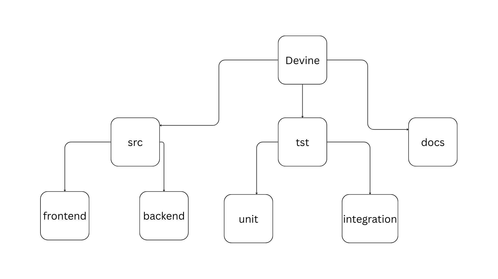

### **File Tree Structure**
- **src**: A directory to store the main source code.
    - **frontend**: All of the front-end code for the webapp.
    - **backend**: All of the back-end code for the webapp.
- **tst**: A directory that serves as an automated test suite.
    - **unit**: The collection of unit tests.
    - **integration**: The collection of integration tests.
- **docs**: A folder to store formal documentation for Devine.

---

### **Review Policy**

This policy concerns the formal review of code before branch commits.
1. **Independent Branch:** If a developer is working on a branch that is solely their responsibility, no code review is required prior to a push.
2. **Shared Branch:** If more than one developer are working on a branch, then a pull request must be generated so that the code from each developer is closely evaluated prior to commiting.
3. **Parent Directory:** If a branch has more than one sub-branches, and a developer must merge changes from one of the subranches, then the developer must create a pull request and evaluate the code with other developers actively working on the other sub-branches.
4. **Pre-Verification:** The individuals involved within a merge or shared branch must verify their respective code through testing before creating a pull request.
5. **Pull Request:** An official Github pull-request must be opened for the individulas involved. Review the code visually and ensure that conflicts do not emerge.
6. **Post-Verification:** Run the verification tests one more time to ensure that the code works when merged together.

---

### **Branching**

##### **Main Branches:**
- `prod` will represent the current state of our build.
- `dev` will be the parent branch of all development work.

##### **Branch Prefixes:**
- `feature-` will exist to develop new features to address issues and their unit tests.
- `fix-` will exist to bugfix falty features.
- `docs-` will exist to develop documentation and handle class assignments.
- `test-` will exist to develop integration and E2E tests.
- `release-` will exist to handle our build releases.

---

### **Standards/Documentation References**
1. https://www.altexsoft.com/blog/technical-documentation-in-software-development-types-best-practices-and-tools/
2. https://medium.com/@sarvt/why-file-structure-is-important-organizing-for-efficiency-and-scalability-056b12f42e43
3. https://appliedtechnology.github.io/protips/folderstructure.html
4. https://medium.com/@jaychu259/git-branch-naming-conventions-2025-the-ultimate-guide-for-developers-5f8e0b3bb9f7

---
